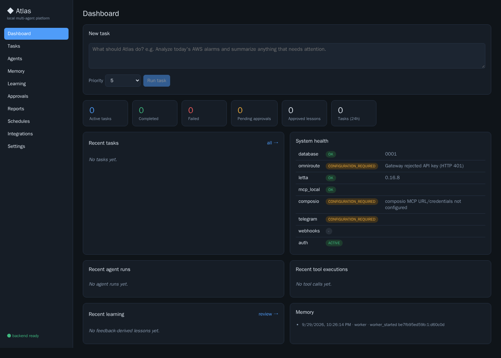

# Atlas — local-first multi-agent AI platform

Atlas runs entirely on your machine with Docker Compose. Every request (Web UI, Telegram, scheduler, local
API, webhooks) becomes the same **Task**. One orchestrator plans it, routes it to specialist agents,
runs tools through MCP (a local MCP server + Composio), validates the results, journals everything in
PostgreSQL, stores long-term memory in pgvector, and learns reusable procedures from your feedback.

```
Telegram / Web UI / Scheduler / Webhooks / API
                  │
          FastAPI control plane ──► tasks table (queue) ──► worker ──► Orchestrator
                                                                          │
                     planner (LLM or rule-based) ── agent registry ── Research · Coding · AWS/DevOps · General
                                                                          │
                     OmniRoute (models)  ·  Tool Registry ─► MCP: local server, Composio (GitHub/AWS/Google)
                                                                          │
               validator ─► report ─► task journal ─► memory consolidation (pgvector) ─► feedback ─► learning
```



## Quick start

Requirements: Docker with Compose v2, ~8 GB free RAM, ~10 GB disk (the OmniRoute and Letta images are large).

```bash
git clone https://github.com/ajeetbr21/atlas.git && cd atlas
cp .env.example .env            # then set ATLAS_API_TOKEN, APPLICATION_SECRET, POSTGRES_PASSWORD
docker compose up -d            # first run builds the backend and frontend images
docker compose ps
```

| URL (localhost only) | What |
|---|---|
| http://localhost:3000 | Web UI (dashboard) |
| http://localhost:8000/docs | API (OpenAPI docs), `/health`, `/ready` |
| http://localhost:20128 | OmniRoute dashboard: connect model providers, create an API key |

Then run the end-to-end demo: `scripts/demo.sh`, or type
*"Analyze today's AWS alarms and summarize anything that needs attention."* into the dashboard.

Everyday commands: `docker compose logs -f api worker`, `docker compose restart worker`,
`docker compose down` (data stays in volumes; `down -v` deletes it). Details: [docs/setup.md](docs/setup.md).

## What works without any credentials

Atlas is fully usable before you connect anything external. Without a model provider the agents run in a
clearly labelled **offline mode**: a rule-based planner/router and a deterministic tool selector that only
executes tools whose arguments can be read directly from the request. Results say
`Offline mode (no LLM available: …)`, and missing integrations are listed as `CONFIGURATION REQUIRED`
instead of being faked.

| Integration | Status out of the box | To enable |
|---|---|---|
| PostgreSQL + pgvector, migrations, task queue, journal, memory, learning, approvals, scheduler, webhooks, reports, Web UI | working | — |
| Local MCP server (time, web fetch, workspace files, git summary, tests) | working | — |
| Letta (session state) | working (`LETTA_ENABLED=true` in `.env.example`) | — |
| OmniRoute model gateway | **CONFIGURATION REQUIRED** — needs a provider + API key | [setup](docs/setup.md#3-connect-a-model-provider-omniroute) |
| Composio MCP (GitHub, AWS, Google) | **CONFIGURATION REQUIRED** | [tools](docs/tools.md#composio-mcp) |
| Telegram bot | **CONFIGURATION REQUIRED** — needs a BotFather token | [telegram](docs/telegram.md) |

## How it was verified

The verification below ran in a Linux sandbox using **Podman 5.2 through its Docker-compatible API
with the Docker Compose v2.39 CLI** (Docker itself was not available there). The compose file is
standard.

**Automated tests (65, all passing):** `scripts/with-test-db.sh bash -c 'cd backend && .venv/bin/pytest -q'`
runs them against a real PostgreSQL 16 + pgvector container and a real in-process MCP server. The
OpenAI-compatible model gateway, Letta, Telegram and the Telegram HTTP client are replaced by scripted
test doubles where a test needs them. That covers LLM tool-calling loops, planning, and session blocks, but
it does not show that a real model answers.

**Full stack (`docker compose up`, all 9 services):** these passed.
- The Section 49 demo through the real Web UI, driven by Playwright with no browser console errors. It covers
  creating a task, reading the result and journal, giving feedback, approving the lesson, seeing a similar
  task apply it, and approving a destructive action before it runs. [Screenshots](docs/screenshots/).
- `scripts/e2e_demo.py`: 30 checks passed (journal events, tool records, memory, learning, approvals).
- A task waiting for approval survived a restart of `api` and `worker`, then completed once approved.
- The worker was killed with SIGKILL in the middle of a tool call. On restart it recovered the task,
  marked the killed attempt `INTERRUPTED` and completed the task.
- A task queued while the worker was stopped ran once the worker started.
- PostgreSQL was restarted and the services reconnected. After a full `down`/`up`, all tasks, memories and
  lessons were still there.
- Schedules fire as normal tasks. Webhook redelivery is deduplicated.
- Requests without a token or with a wrong one get 401. Cross-origin writes get 403. Unknown Host headers
  and webhooks sent through the UI proxy are refused.
- A real Letta 0.16.8 server stored session blocks. The local MCP server's 9 tools were discovered with
  token authentication.

**Not verified:**
- A real LLM answer. Requests reached the OmniRoute container, but its built-in free providers refused them
  (HTTP 403/400/502) and there were no provider credentials, so every task ran in offline mode.
- Composio and Telegram, because there were no credentials.

## Documentation

- [Architecture](docs/architecture.md): pipeline, services, data model, transactions, recovery
- [Setup](docs/setup.md): install, configuration, development, tests
- [Agents](docs/agents.md) · [Tools & MCP](docs/tools.md) · [Memory](docs/memory.md) · [Learning](docs/learning.md)
- [Telegram](docs/telegram.md) · [API](docs/api.md) · [Troubleshooting](docs/troubleshooting.md)

## Repository layout

```
docker-compose.yml        postgres, migrate, api, worker, mcp-local, telegram, frontend, omniroute, letta
.env.example              every setting, no real credentials
backend/app/              FastAPI app, worker, orchestrator, agents, tools, memory, learning, integrations
backend/alembic/          database migrations
backend/tests/            pytest suite (unit, integration, end-to-end, recovery)
backend/scripts/          e2e_demo.py (runs inside the api container)
frontend/                 React + TypeScript dashboard (Vite, served by nginx)
docker/                   backend Dockerfile, postgres init
scripts/                  demo.sh, ui_demo.py (Playwright), with-test-db.sh, dev-db.sh
docs/
```
